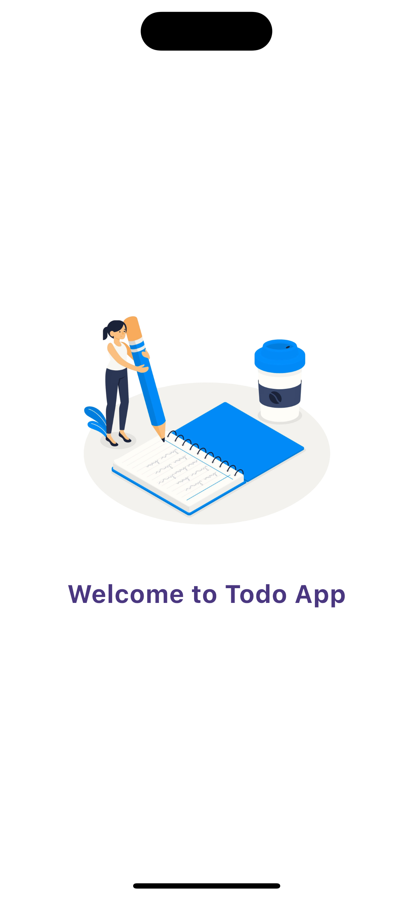
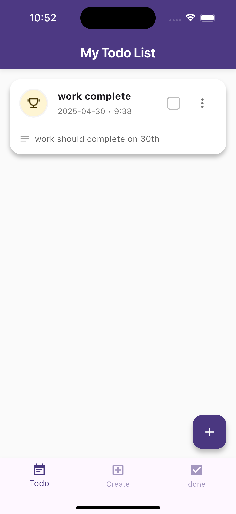
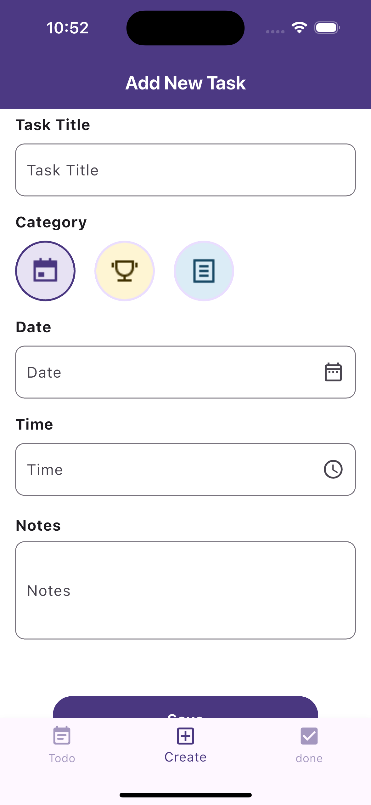
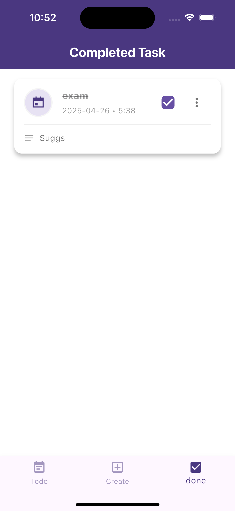

# 📌 Taskify - Flutter Task Manager

 

Taskify is a modern task management application built with Flutter. It offers intuitive task organization, smart scheduling with notifications, and a responsive UI powered by the MVVM architecture.

---

## ✨ Features

### ✅ Core Functionality
- Create, edit, and delete tasks
- Mark tasks as complete/incomplete
- View completed task history
- Schedule tasks with timezone-aware reminders

### ⚙️ Technical Highlights
- MVVM architecture for clean separation of concerns
- Hive for fast and secure local storage
- Provider for efficient state management
- Timezone-aware scheduled notifications
- Responsive UI across all screen sizes

---

## 📱 Screenshots

| Todo Page | Create Task | Completed Tasks |
|-----------|-------------|-----------------|
|  |  |  |

> ⚠️ **Note:** Make sure all image files are inside the `assets/screenshots/` folder and listed correctly in your `pubspec.yaml`.

---

## 🛠 Tech Stack

- **Framework:** Flutter 3.x  
- **State Management:** Provider  
- **Local Database:** Hive  
- **Notifications:** `flutter_local_notifications`

---

## 📦 Dependencies

```yaml
dependencies:
  flutter:
    sdk: flutter
  cupertino_icons: ^1.0.6
  flutter_local_notifications: ^18.0.1
  hive_flutter: ^1.1.0
  timezone: ^0.9.4
  provider: ^6.1.2
  permission_handler: ^11.3.1
  flutter_timezone: ^2.1.0
  intl: ^0.20.2
```

---

## 🚀 Getting Started

### 🔧 Installation
1. Clone the repo  
   ```bash
   git clone https://github.com/yourusername/taskify.git
   cd taskify
   ```

2. Get the packages  
   ```bash
   flutter pub get
   ```

3. Generate Hive adapters (if needed)  
   ```bash
   flutter packages pub run build_runner build
   ```

4. Run the app  
   ```bash
   flutter run
   ```

---

## 📁 Project Structure

```
lib/
├── models/             # Task model
├── view_models/        # TaskViewModel (business logic)
├── views/              # Screens (UI)
├── widgets/            # Reusable components
├── services/           # Notification setup
├── main.dart           # Entry point
```

---

## 🔮 Future Roadmap
- ✅ Real-time syncing with Firebase
- ✅ Email and media-based task sharing
- ✅ Multi-device sync
- ✅ Advanced filters & search

---

## 🤝 Contributing
Contributions are welcome! Feel free to fork the repo and submit a pull request.

---

## 📄 License
This project is licensed under the MIT License.
